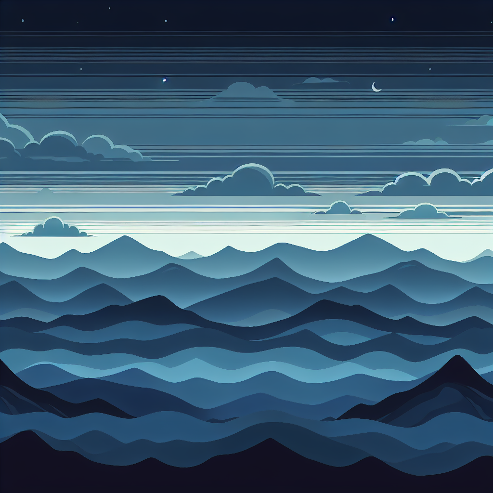

# Parallax Scrolling GIF Generator using OpenAI DALL-E-3

This program generates parallax backgrounds using OpenAI's **DALL-E-3**.
Prompts are crafted by **GPT-4.1 Nano** to create images with 4 distinct layers (256px each).
An algorithm extracts each layer, making the rest transparent.
These layers simulate parallax scrolling, recorded as a GIF.

Prompts, images, layers, and GIFs are stored in their respective directories with timestamped filenames. 
This entire flow is automated via a [GitHub Actions workflow](.github/workflows/gif_publisher.yml) **CRON** that executes daily at 04:00 UTC (06:00 CET).

**IMPORTANT**: The quality of generated GIFs is heavily dependent on the OpenAI endpoints performing optimally. 
A subpar GPT-4 prompt will inevitably lead to DALL-E generating unsuitable images. My parallax algorithm specifically requires 4 distinct 256px layers - any deviation causes rendering issues. 
Additionally, the GIF generation pipeline may produce totally botched results when image colors fall outside the expected palette or when pixels cannot be effectively mapped using Euclidean distance calculations.

## Today's GIF

## Today's Image

**Prompt:** Background for 2d side-scrolling game, which have 4 separate horizontal layers. Layer 1: Distant mountains with soft gradients. Layer 2: Rolling hills with sparse trees. Layer 3: Closer bushes and small rocks. Layer 4: Detailed grass, flowers, and a winding path.
